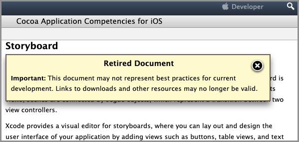

# Apple Localization Roadmap

## Contents 
[Overview](#overview-) •
[Resources](#resources-)

## Overview [▴](#contents)

Apple has retired and archived the Storyboard documentation. The replacement for Storyboards is SwiftUI.

* [https://developer.apple.com/library/archive/documentation/General/Conceptual/Devpedia-CocoaApp/Storyboard.html](https://developer.apple.com/library/archive/documentation/General/Conceptual/Devpedia-CocoaApp/Storyboard.html) 
* [https://developer.apple.com/xcode/swiftui/](https://developer.apple.com/xcode/swiftui/)

The storyboard files can be found as `*.storyboard` and `*.xib` files in the repository. A `*.xib` file is an outdated form for a storyboard file. 

Here is a table which shows how many files are needed for each local translation.

| Android               | Apple Storyboard    | Apple SwiftUI |
|:----------------------|:-----------------------|:-----------------------|
| values-es/strings.xml | InfoPlist.strings   | InfoPlist.strings 
|                       | Localizable.strings | Localizable.strings
|                       | DozeDetailLayout.storyboard | swiftui.strings |
|                       | DozeDetailSizeHeader.xib |     |
|                       | DozeDetailSizeUnitHeader.xib |     |
|                       | ( … snip … ) |     |
|                       | DozeDetailData.json | DozeDetailData.json |
|                       | TweakDetailData.json | TweakDetailData.json |
| Total: 1 file/translation | Total: 30 files/translation | Total: 5 files/translation

Android is efficient for localization implementation. Only one file is needed for each Android localization.

Apple Storyboards is an evolution from Steve Job's NeXT computer which was leveraged 1988 ExperLisp Interface Builder technology. Each `*.storyboard` and `*.xib` file has exactly one corresponding `*.strings` file per localization.

Thus, 43 translations ends up with 1,290 files added to the `daily-dozen-ios` project when the outdated Storyboard approach is used!!

In contrast, SwiftUI will allow for the many, many `*.strings` files to be consolidated into a single Strings file like Android has a single XML file. A SwiftUI implementation will mean "bye-bye" to about a thousand localization files. 

The `daily-dozen-localization` TSV files files are also designed to support the migration of localizations from a Storyboard implementation to a SwiftUI implementation.

## Resources [▴](#contents)

* [Apple Storyboards](https://developer.apple.com/library/archive/documentation/General/Conceptual/Devpedia-CocoaApp/Storyboard.html) _archived documentation. last update: 2018-04-06._ 
* [Apple SwiftUI](https://developer.apple.com/xcode/swiftui/)

