# Daily Dozen App Localization QuickStart Guide

_This QuickStart provides a summary of "how to" download, edit, report issues, and submit language translations for the Daily Dozen applications._

_This Daily Dozen App Localization QuickStart Guide is located in the documents folder at [Documents/Quickstart.md](https://github.com/nutritionfactsorg/daily-dozen-localization/blob/master/Documents/Quickstart.md). Feedback for the documentation can be submitted on the [daily-dozen-localization/issues](https://github.com/nutritionfactsorg/daily-dozen-localization/issues) page._

**Contents: **
[Overview](#overview-) •
[Setup](#setup-) •
[Spreadsheet Files](#spreadsheet-files-) •
[Markdown Text Files](#markdown-text-files-) •
[Issue Discussions](#issue-discussions-) •
[Resources](#resources-)

## Overview [▴](#contents)

[GitHub](https://en.wikipedia.org/wiki/GitHub) is used as a repository to coordinate language translations for the Android and Apple Daily Dozen applications. The language translation workflow, as described in this quickstart document,  _does not require any of particular knowledge of [git](https://en.wikipedia.org/wiki/Git) itself._

The primary file format used for translation is a spreadsheet in the [TSV (Tab Separated Value)](https://en.wikipedia.org/wiki/Tab-separated_values) text format.  TSV files can be imported and exported by any widely available spreadsheet program such as Apple Numbers, LibreOffice Calc and Microsoft Excel.

A second file format used is [Markdown](https://en.wikipedia.org/wiki/Markdown) text. Markdown is used for (1) documentation like this quickstart page, (2) the longer text used in the application's "About" screen and (3) the text in the Apple App Store and Google Play Store landing pages. A markdown file can be edited as either plain text or with a Markdown editor.

## Setup [▴](#contents)

**GitHub Account.** Use [https://github.com/join](https://github.com/join) to setup up a GitHub account, if you do not already have one.  An account is free.  An account is needed to submit translations and participate in online issue reporting & discussions.

**Spreadsheet Application.** A spreadsheet program which can import and export TSV formatted spreadsheets is required. [Apple Numbers](https://www.apple.com/numbers/), [LibreOffice Calc](https://www.libreoffice.org/discover/calc/), [Microsoft Excel](https://www.microsoft.com/en-us/microsoft-365/excel), or similar can be used.

**Markdown or Plain Text Editor.** A markdown editor or plain text editor is needed. There are many choices available. See the Resources section below for some applications which can be used to edit markdown files.

## Spreadsheet Files [▴](#contents)

**Step 1. Download TSV Spreadsheet File**

Go to the [dashboard](https://github.com/nutritionfactsorg/daily-dozen-localization#dashboard-). Click on the language to be translated in the "Language" column of the dashboard.

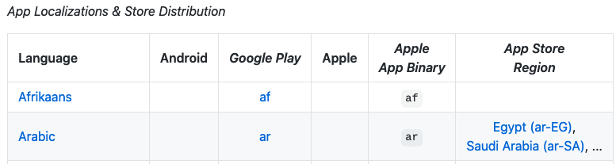 

For example, a click on "Arabic" will go to the "daily-dozen-localization/Languages/Arabic" folder.

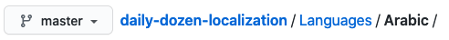

The folder contents will show several folders including one named `tsv`.

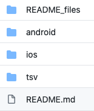

Click the `tsv` folder to show the `tsv` folder contents. The folder will contain a file with the Language name, Language code and `*.tsv` extension.

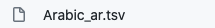

Context click to download the file to your local machine.

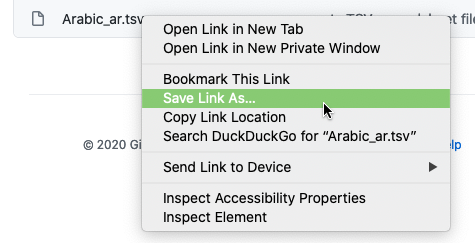

**Step 2. Translate & Edit File**

Open the `*.tsv` file in a spreadsheet application.

Data in field columns with have header names which begin with `key_` or `base_` are not to be translated. In particular, the `key_android`, `key_apple` entries are used for mapping values back into the device specific localization files.  These `key_` values must not be changed.

The `base_comment`, if present, provides translation guidance in the development language (English).

The columns which begin with `lang_` are to be translated.

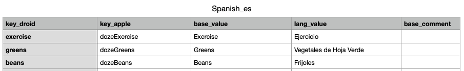

Extra columns can be added for the translators' convenience for status, note taking, etc. Any extra column names should not begin with `key_`, `base_` or `lang_`. Any extra columns will be ignored upon import back into the device specific formats.

**Step 3. Submit TSV File** 

Export the spreadsheet back to a TSV file format.  Add a `*.txt` extension to the translated file. GitHub requires the `*.txt` extension to accept the uploaded file.

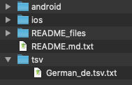

Create a [nutritionfactsorg/daily-dozen-localization issue](https://github.com/nutritionfactsorg/daily-dozen-localization/issues) to submit the completed translation. Put the language (see folder name) at the beginning of the subject. Also add "translation submitted" to the subject.

Drag and drop the file to the "Attached file ..." area.

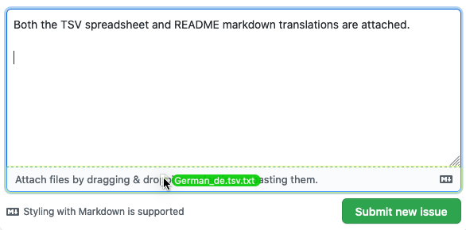

Click the "Submit new issue" button.

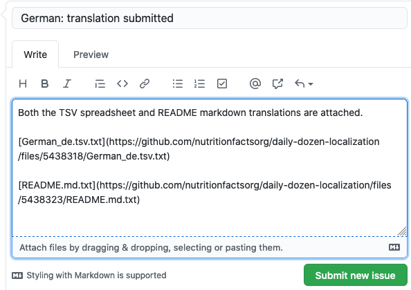

## Markdown Text Files [▴](#contents)

**Step 1. Download README.md Markdown File** 

Go to the [dashboard](https://github.com/nutritionfactsorg/daily-dozen-localization#dashboard-). Click on the language to be translated in the "Language" column of the dashboard.

 

For example, a click on "Arabic" will go to the "daily-dozen-localization/Languages/Arabic" folder.

The folder contents will contain a file named `README.md`.

Use the context menu "Save Link as..." to download the `README.md` file to your local machine.

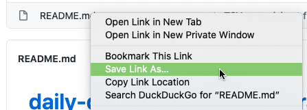

**Step 2. Translate & Edit** 

Use the [Languages/English_US file](https://github.com/nutritionfactsorg/daily-dozen-localization/blob/master/Languages/English_US/README.md) as a reference for the translation.

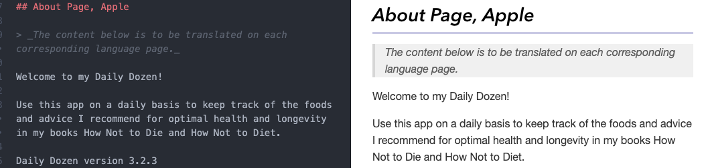

Edit the markdown file to be translated with a markdown editor or plain text file editor.

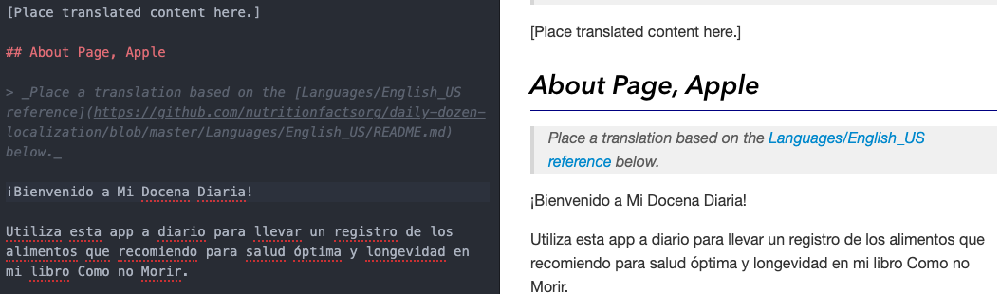

Save the changes.

**Step 3. Submit Markdown File** 

Add a `*.txt` extension to the translated markdown readme file. GitHub requires the `*.txt` extension to accept the uploaded file.

Create a [nutritionfactsorg/daily-dozen-localization issue](https://github.com/nutritionfactsorg/daily-dozen-localization/issues) to submit the completed translation. Put the language (see folder name) at the beginning of the subject. Also add "translation submitted" to the subject.

Drag and drop the file to the "Attached file ..." area.

Click the "Submit new issue" button.

## Issue Discussions [▴](#contents)

Create a [nutritionfactsorg/daily-dozen-localization issue](https://github.com/nutritionfactsorg/daily-dozen-localization/issues) to report problems, provide feedback and ask questions.  Please put the affected language (see folder name) at the beginning of the subject, if applicable.  The label "translation discussion" can be added to identified topics intended for discussion.

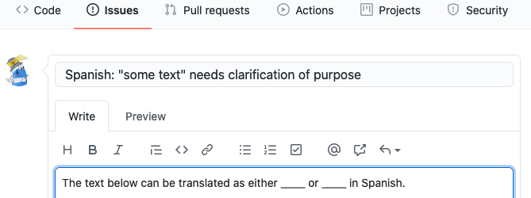

## Resources [▴](#contents)

* Markdown Editors
    * [Atom ⇗](https://atom.io/) Linux/macOS/Windows, free, open source
        * [Markdown Preview package ⇗](https://atom.io/packages/markdown-preview) included with the default Atom install.
        * [markdown-preview-enhanced ⇗](https://atom.io/packages/markdown-preview-enhanced) optional package for more advanced Markdown editing.
    * [MacDown ⇗](https://macdown.uranusjr.com/) macOS, free, open source
