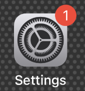
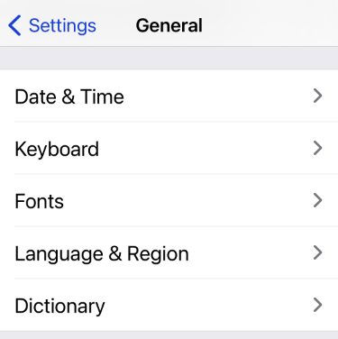
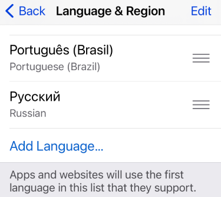
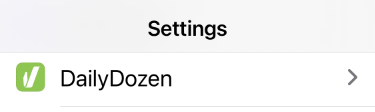
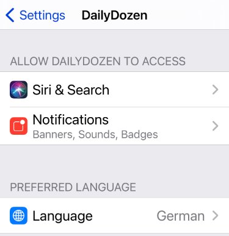
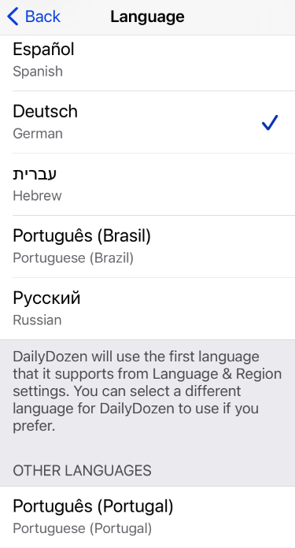
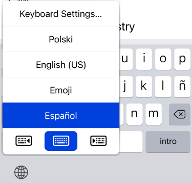

# Testing: Multilingual iOS Devices

The Apple platform (iOS 13 and newer) supports language selection on a "per application" basis. _However, the "per application" language selection capability may not initially be visible to the device user._

If a "per app language setting" via the Settings app is not visible, then a second language need to be enabled for the device. The addition of a second language (any language) will cause the device to switch from a "single language" mode to be in a "multilingual" mode. 

After any second language has been added at the device level, then all language choices available for the app will be visible in the device `Settings` > `Daily Dozen` > `Preferred Language` section.

The following items can be _independently set_ on a multilingual iOS device:

1. **App Language** Use the Settings application to select any language that the application supports.

    

    

    
        
    

2. **Keyboard Language.** Press and hold the "globe" icon to change between languages on the keyboard.  The keyboard language selection is independent from the device and application language selection.

   

3. **Device Region.** The region is set for the whole device in the system Settings application. The region setting can affect some of the date and time appearances in the Daily Dozen application. Go to the system Settings application to the desired region in `Settings` > `General` > `Languages & Regions`.

    
