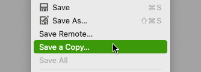
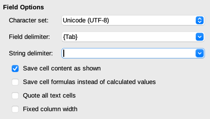
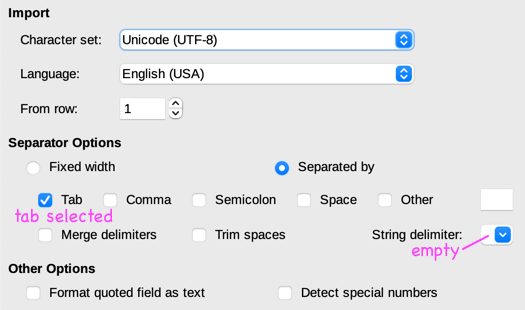

# README: `English_US` Reference Spreadsheets

## Contents 
[TSV Import](#tsv-import-) •
[TSV Export](#tsv-export-) •
[Resources](#resources-)

The `English_US` `*.fods` spreadsheets provide the baseline reference `.tsv` files used in the `daily-dozen-localization` repository. The [OpenDocument Spreadsheet](https://en.wikipedia.org/wiki/OpenDocument#Specifications) `*.fods` file is a non-proprietary, open standard (ISO/IEC 26300) XML format.

_Do not use any character_ (for example, a double quote `"`) _as the **String delimiter**_ during both the import and export of TSV files.

Notes:

* tabs are not allowed as part of the `daily-dozen-localization` translation copy.
* tabs are only used for separation of the columns in the `daily-dozen-localization` TSV format.
* given the above, _tsv escaped quotes_ `""` are not needed and can be avoided.
* avoiding _tsv escaped quotes_ `""` allows for the TSV text files to be easier for human reading and matches what a translator sees in a spreadsheet application.
* avoiding _tsv escaped quotes_ `""` reduces the complexity of programatic processing of the TSV files.

The [LibreOffice Calc](https://www.libreoffice.org/discover/calc/) spreadsheet application provides control options for the `String delimiter` during import and export of TSV files.

## TSV Export [▴](#contents)

1. Use the "File > Save a Copy…" menu to start the export.

2. Set the following options: 
    * Select "Text CSV (.csv)" as the file type. This file type also supports TSV (.tsv) exports via the subsequent filter settings.
    * Uncheck "Automatic file name extension". This allows setting the extension to `.tsv`
    * Check "Edit filter settings". 

3. Set the file name extension to `.tsv`, if not already set. Then click "Save".

4. Set the Field Options in the filter settings:
    * Character set: Unicode (UTF-8)
    * Field delimiter: {Tab} which is needed for the TSV format.
    * String delimiter: verify to by empty.
    * Check "Save cell content as shown"
    * Uncheck "Quote all text cells"

5. Click `OK`.

## TSV Import [▴](#contents)

1. Open a TSV file. 

2. Set import **Separator options** to **Tab** 
    * The `*.tsv` files managed in the `daily-dozen-localization` repository should be imported with the **String delimiter** _empty_.
    * If a `*.tsv` file is imported from another source, which uses String delimiters, then that String delimiter will need to be used instead.

## Resources [▴](#contents)

* [Wikipedia: Tab-separated values ⇗](https://en.wikipedia.org/wiki/Tab-separated_values)
