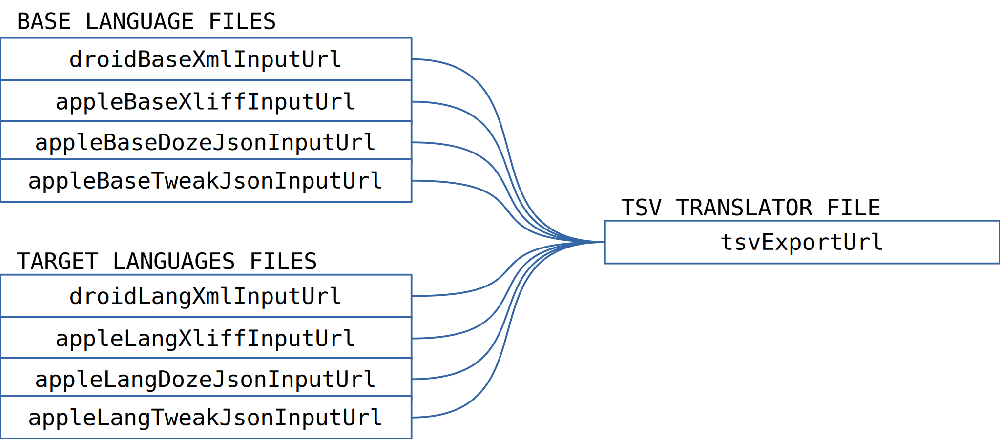
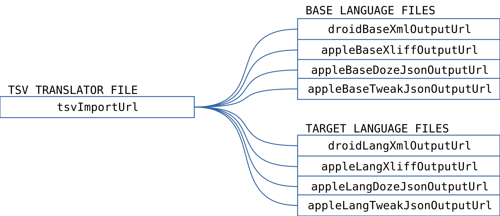

# daily-dozen-localization

DRAFT CANDIDATE PROCESS

## Contents 
[Localization Workflow](#localization-workflow-) •
[File Name Convention](#file-name-convention-) •
[Language Support](#language-support-) •
[Resources](#resources-)

## Localization Workflow [▴](#contents)

**Phase 1. Export.** The Android and Apple exported localization files are merged into a spreadsheet compatible Tab Separated Value (TSV) files.

**Phase 2. Translation.** The Tab Separated Value (TSV) format and be convenient imported and exported with various popular spreadsheet programs for the translators' use.

Data in field columns with have header names which begin with `key_` or `base_` _are not to be translated_. In particular, the `key_android`, `key_apple` entries are used for mapping values back into the device specific localization files.

The `base_comment` provides translation guidance in the development language (English). 

Extra columns can be added for the translators' convenience. The extra column names should not begin with `key_`, `base_` or `lang_`. The extra columns will be ignored upon import back into the device specific format.

**Phase 3. Import.** The completed TSV files are used to generate Android and Apple localization import files.

## File Name Convention [▴](#contents)
 
Since the TSV files may be manually distributed for processed by humans, a `language-datestamp-tag-poc.tsv` file name convention can be used to help keep track of which file is which.

* `language`: language code. For example, `en`, `es`, `en_rGB`.
* `datestamp`: Date and time based on either of the following formats.
     * yyyyMMdd: 20200413 (year, month, day)
     * yyyyMMdd_HHmm:  20200413_1327 (year, month, day, 0-24 hours, minutes)
* `tag`: Use to provide some at-a-glance status. For example:
    * `export`, `ExportToTranslate`
    * `wip`, `WorkInProgress`
    * `import`, `ReadyToImport` 
* `poc`: individual point of contact, if applicable
    * GitHub id
    * initials

_File Name Examples_

* `de-20200219_1600-ExportToTranslate.tsv` A file computer generated file to be translated.
* `en_rGB-20200219-wip-ABC.tsv` A file which has been partially translated by person ABC. Perhaps, pending some review or feedback. 
* `ru-20200819-ReadyToImport-XYZ.tsv` A translation completed by person XYZ which is ready for automated import processing back to the device source code.

## Language Support [▴](#contents)

_Existing Translations_

| Language    | Code | Android | iOS |
|-------------|:----:|:-------:|:------:|
| Bulgarian   | `bg` | ✓       |        |
| Chinese     | `zh` | ✓       |        |
| English     | `en` | ✓       | ✓
| German      | `de` | ✓       |        |
| Greek       | `el` | ✓       |        |
| French      | `fr` | ✓       |        |
| Italian     | `it` | ✓       |        |
| Portuguese  | `pt` | ✓       |        |
| Romanian    | `ro` | ✓       |        |
| Russian     | `ru` | ✓       |        |
| Spanish     | `es` | ✓       | ✓      |  

_User Submissions_

| Language|Code|Android|iOS| Notes
|---------|:--:|:--:|:--:|:-------
| Catalan                | `ca`   | [PR#123][] |        | new submission
| English, Great Britain |`en-rGB`| [PR#120][] |        | British version words
| Hungarian              | `hu`   | [PR#119][] |        | new submission
| Italian                | `it`   | [PR#117][] |        | native speaker update
| Japanese               | `jp`   | [PR#138][] |        | started translation

[PR#117]:https://github.com/nutritionfactsorg/daily-dozen-android/pull/117
[PR#119]:https://github.com/nutritionfactsorg/daily-dozen-android/pull/119
[PR#120]:https://github.com/nutritionfactsorg/daily-dozen-android/pull/120
[PR#123]:https://github.com/nutritionfactsorg/daily-dozen-android/pull/123
[PR#138]:https://github.com/nutritionfactsorg/daily-dozen-android/pull/138

> Note: The community submitted pull requests may based on the Daily Dozen and not yet have the 21 Tweaks translation.

## Resources [▴](#contents)

* Android Developer
    * ["Localize Your App" ⇗](https://developer.android.com/guide/topics/resources/localization)
* Apple Developer 
    * [Article: "Localizing Your App" ⇗](https://developer.apple.com/documentation/xcode/localizing_your_app)
    * [Localization ⇗](https://developer.apple.com/localization/)
* [Language ISO 639-1 codes ⇗](https://en.wikipedia.org/wiki/List_of_ISO_639-1_codes)